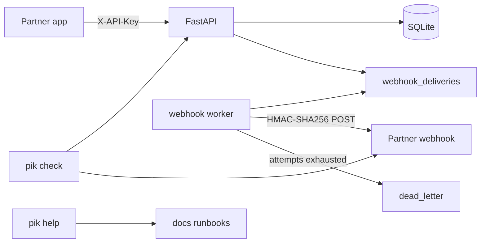

# Partner Integration Kit

Partner Integration Kit is a small, runnable partner platform. It has an authenticated HTTP API, signed outbound webhooks with retries and a dead-letter queue, Python and TypeScript clients generated from the OpenAPI document, an onboarding CLI, and a help bot that maps an error payload to a runbook fix without calling an LLM.

Author: Gyan Mistry ([misty6g](https://github.com/misty6g)).

## Architecture



SQLite is the default database so the API and the worker can share one file in WAL mode. Set `PIK_REDIS_URL` to count rate limits in Redis instead. Postgres works through `DATABASE_URL` if you point SQLAlchemy at it; the tests and the measurements below use SQLite.

## Quickstart

Python 3.11 or newer.

```bash
python -m venv .venv
source .venv/bin/activate
pip install -e ".[dev]"
uvicorn pik_api.main:create_app --factory --host 127.0.0.1 --port 8400
```

In another shell, start the delivery worker against the same database:

```bash
source .venv/bin/activate
python -m pik_api.worker
```

With `PIK_SEED_DEMO=1` (the default) the API creates two test partners:

| Partner | API key |
| --- | --- |
| Acme Robotics | `pk_test_acme_7f3a9c2e1b84d0` |
| Northwind Outdoors | `pk_test_northwind_b41d8e0a6c` |

```bash
curl -s http://127.0.0.1:8400/v1/account \
  -H "X-API-Key: pk_test_acme_7f3a9c2e1b84d0"

curl -s http://127.0.0.1:8400/v1/orders \
  -H "X-API-Key: pk_test_acme_7f3a9c2e1b84d0" \
  -H "Idempotency-Key: ord_demo_1001" \
  -H "Content-Type: application/json" \
  -d '{"external_id":"ord_demo_1001","currency":"usd","customer":{"name":"Ada Lovelace","email":"ada@analytical.example"},"items":[{"sku":"WIDGET-1","quantity":2,"unit_amount":2500}]}'

pik check \
  --base-url http://127.0.0.1:8400 \
  --api-key pk_test_acme_7f3a9c2e1b84d0 \
  --webhook-url http://127.0.0.1:9/hooks

pik help "429 rate_limit_exceeded Too many requests. Retry-After 12"
```

Interactive docs are at [http://127.0.0.1:8400/docs](http://127.0.0.1:8400/docs).

Docker Compose runs the API and the worker on one SQLite volume. Redis is behind the `redis` profile and is not started by default.

```bash
docker compose up --build
```

## API

All partner routes use `X-API-Key`. Keys are stored as SHA-256 hashes. `GET /v1/health` and `GET /v1/ready` are public.

| Resource | What it is for |
| --- | --- |
| `GET /v1/account` | Who the key belongs to, plus the rate limit |
| `POST /v1/orders`, `GET /v1/orders`, `GET /v1/orders/{id}` | Create and read orders. Amounts are integer minor units |
| `POST /v1/orders/{id}/fulfill`, `POST /v1/orders/{id}/cancel` | Move an `open` order to `fulfilled` or `cancelled` |
| `GET /v1/events`, `POST /v1/events` | Poll the event log, or publish a partner event such as `inventory.updated` |
| `POST /v1/webhook_endpoints` | Register a URL. The signing secret is returned once |
| `GET /v1/webhook_deliveries`, `POST /v1/webhook_deliveries/{id}/replay` | Inspect deliveries and requeue a failed or dead-lettered one |

Lists are cursor pages. `limit` defaults to 20 and stops at 100. Pass `next_cursor` back as `starting_after`. Order is `created_at` descending, then `id`.

`Idempotency-Key` on a POST stores the status and body. The same key and the same raw body replay that response and set `Idempotent-Replayed: true`. A different body with the same key returns `409 idempotency_key_conflict`.

The default rate limit is 120 requests per 60 seconds per key. Responses include `X-RateLimit-Limit`, `X-RateLimit-Remaining`, and `X-RateLimit-Reset`. A full window returns `429` and `Retry-After`. The counter is an atomic upsert, so concurrent requests do not collide on the window row.

Errors share one JSON shape: `type`, `code`, `message`, `doc_url`, and `request_id`. The runbooks under `docs/` match those codes.

## Webhooks

Creating, fulfilling, or cancelling an order writes an event and one delivery row per active endpoint subscribed to that type (`order.created`, `order.fulfilled`, `order.cancelled`, or `*`). `POST /v1/webhook_endpoints/{id}/ping` sends `webhook.ping` to that endpoint only.

The worker claims due rows and POSTs the stored body. The signature header is:

```text
Pik-Signature: t=<unix seconds>,v1=<hex hmac sha256>
```

The signed string is `{timestamp}.{raw_body}` using the endpoint secret (`whsec_...`). Other headers are `Pik-Delivery`, `Pik-Event-Id`, and `Pik-Event-Type`. Verifiers should use the raw body, a five-minute replay window, and a constant-time compare. Each attempt gets a new timestamp. Deduplicate on `Pik-Delivery`.

A non-2xx response or a connection error is a failure. Delay after attempt `n` is `min(cap, base * 2^(n-1))`. The defaults are a 1 second base, a 32 second cap, and 5 attempts. The next state is `failed` until the budget is gone, then `dead_letter`. `POST /v1/webhook_deliveries/{id}/replay` sets the row back to `pending` with `attempt_count` 0. A row that is `in_flight` returns `409 delivery_in_flight`.

Webhook URLs must be absolute `http` or `https` with no userinfo. Link-local addresses and cloud metadata hostnames are rejected. Loopback is allowed so a local receiver works.

## SDKs

`openapi/openapi.json` is exported from the FastAPI app. `scripts/generate_sdks.sh` regenerates clients with OpenAPI Generator 7.13.0:

- Python: `sdk/python/generated` (`pik_client`, urllib3)
- TypeScript: `sdk/typescript/generated` (`typescript-fetch`)

The generator's TypeScript `ToJSON` helpers spread the input object and then add snake_case keys, which sends both `unitAmount` and `unit_amount`. The script deletes that spread so the body matches the API.

Handwritten verifiers, covered by one shared HMAC vector:

- Python: `pik_sdk.webhooks.verify`
- TypeScript: `sdk/typescript/src/webhooks.ts` (`npm test` in that directory)

```bash
pip install ./sdk/python/generated
python examples/python/create_order.py

cd sdk/typescript/generated && npm install && npm run build && cd ../../..
node --experimental-strip-types examples/typescript/create_order.mjs
```

Both examples create an order, register a localhost receiver, ping it, and verify the signature in the receiver and again from the ping response.

## Onboarding CLI

`pik check` prints a pass, fail, or skip line for each step and exits 1 when anything failed.

1. **API key validity.** `GET /v1/account`.
2. **Webhook endpoint reachability.** POST a probe. Any HTTP response passes. Connection errors fail.
3. **Signature verification round-trip.** Register a temporary endpoint, ask the API to sign a ping, verify it locally with the returned secret, then disable the endpoint. The signature can match even when the URL is down. Reachability is the separate check.
4. **TLS certificate.** HTTPS URLs get a default-trust handshake. Plain HTTP is skipped. `--insecure` only affects the reachability probe.

`pik help "..."` answers from the runbooks.

## Help bot

`pik help` and `python -m pik_bot` split `docs/*.md` on `##` headings and rank them with BM25 (`k1=1.5`, `b=0.75`). With no API key the suggestion is the **Fix** paragraph of the top section (`mode=retrieval`). Set `PIK_LLM_API_KEY` or `OPENAI_API_KEY` to send those sections to an OpenAI-compatible chat endpoint. If that call fails, the same retrieved fix is returned.

The labeled set is `src/pik_bot/eval_set.json`: 16 queries, mostly the API's own error payloads, plus a few plain-language webhook failures. Each row names the runbook anchor that should win.

## Measurements

Recorded by `python scripts/measure.py` on 2026-10-06 against Python 3.12.3 (`Linux-6.12.94+`). The raw output is `measurements/results.json`.

| Measurement | Result | How |
| --- | --- | --- |
| Pytest | 46 passed | `python -m pytest --cov=src --cov-report=term -o addopts=` |
| Coverage | 93% | Coverage.py branch coverage over `src/` (statements 1503, missed 70, branches 258, partial 41) |
| TypeScript verifier | 4 passed | `npm test` in `sdk/typescript` (node:test) |
| Webhook drill | 24 succeeded, 6 dead-lettered, 0 bad signatures | 30 deliveries. The receiver returns HTTP 500 on attempt 1 for every delivery, and on every attempt for 6 of the 30. Max 5 attempts, backoff base 0.05s so the drill finishes in real time. The worker code path is the production one. 78 signature checks passed. Successes took a median of 2 attempts. Elapsed 2.524s |
| `GET /v1/orders` latency | p50 30.322 ms, p95 63.363 ms | 200 samples, concurrency 8, 20 warmup calls excluded, 0 errors. One uvicorn process, SQLite, `127.0.0.1:8411` |
| `POST /v1/orders` latency | p50 58.153 ms, p95 93.588 ms | 100 samples, same server and concurrency, 0 errors |
| Help bot | top-1 16/16, top-3 16/16 | `python -m pik_bot` over the 16 labeled cases |

Percentiles use linear interpolation on the sorted sample.

## Development

```bash
pip install -e ".[dev]"
python -m pytest --cov=src --cov-fail-under=85
npm test --prefix sdk/typescript
python scripts/export_openapi.py
sh scripts/generate_sdks.sh
python scripts/measure.py
```

GitHub Actions (`.github/workflows/ci.yml`) runs the pytest suite on Python 3.11 and 3.12, the TypeScript verifier on Node 22, and fails if `openapi/openapi.json` drifts from the app.

## License

MIT. See [LICENSE](LICENSE).
